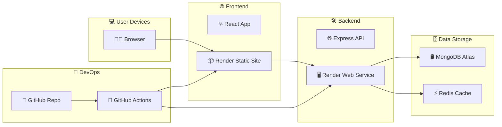
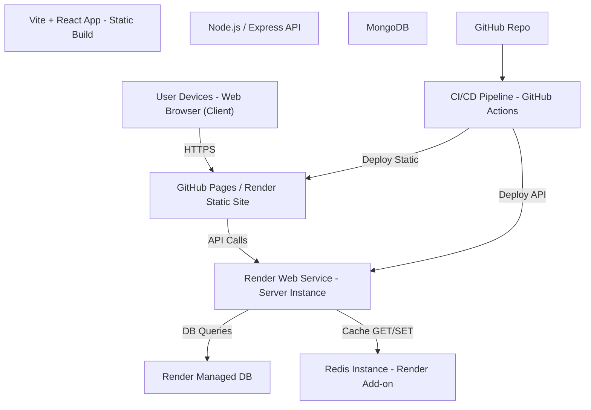

# qts-v1.3.0
Quartzion Technology Solutions corp Website v1.3.0

**Cloud Architecture**

```mermaid
flowchart LR

%% User
subgraph "💻 User Devices"
  A1["🧑‍💻 Browser"]
end

%% Frontend
subgraph "🌐 Frontend"
  B1["⚛️ React App"]
  B2["📦 Render Static Site"]
end

%% Backend
subgraph "🛠 Backend"
  C1["🌐 Express API"]
  C2["🖥 Render Web Service"]
end

%% Data
subgraph "🗄 Data Storage"
  D1["🛢 MongoDB Atlas"]
  E1["⚡ Redis Cache"]
end

%% DevOps
subgraph "🔧 DevOps"
  F1["📁 GitHub Repo"]
  F2["🤖 GitHub Actions"]
end

%% Connections
A1 --> B2
B2 --> C2
C2 --> D1
C2 --> E1
F1 --> F2
F2 --> B2
F2 --> C2
```
---
**Detailed workflow**

```mermaid
flowchart TD
    UD_Web["User Devices - Web Browser (Client)"]

    FE_Vite["Vite + React App - Static Build"]
    FE_Static["GitHub Pages / Render Static Site"]

    BE_Node["Node.js / Express API"]
    BE_Render["Render Web Service - Server Instance"]

    DB_PG["MongoDB"]
    DB_Render["Render Managed DB"]

    CACHE_R["Redis Instance - Render Add-on"]

    DEV_Repo["GitHub Repo"]
    DEV_CI["CI/CD Pipeline - GitHub Actions"]

    UD_Web -->|HTTPS| FE_Static
    FE_Static -->|API Calls| BE_Render
    BE_Render -->|DB Queries| DB_Render
    BE_Render -->|Cache GET/SET| CACHE_R

    DEV_Repo --> DEV_CI
    DEV_CI -->|Deploy Static| FE_Static
    DEV_CI -->|Deploy API| BE_Render
```
