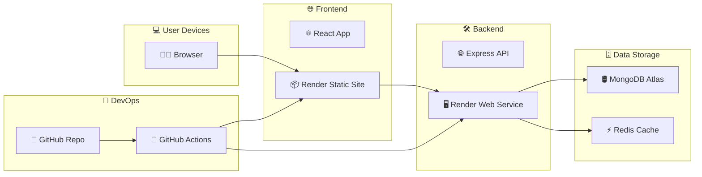

```mermaid
flowchart LR

%% User
subgraph "💻 User Devices"
  A1["🧑‍💻 Browser"]
end

%% Frontend
subgraph "🌐 Frontend"
  B1["⚛️ React App"]
  B2["📦 Render Static Site"]
end

%% Backend
subgraph "🛠 Backend"
  C1["🌐 Express API"]
  C2["🖥 Render Web Service"]
end

%% Data
subgraph "🗄 Data Storage"
  D1["🛢 MongoDB Atlas"]
  E1["⚡ Redis Cache"]
end

%% DevOps
subgraph "🔧 DevOps"
  F1["📁 GitHub Repo"]
  F2["🤖 GitHub Actions"]
end

%% Connections
A1 --> B2
B2 --> C2
C2 --> D1
C2 --> E1
F1 --> F2
F2 --> B2
F2 --> C2
```
